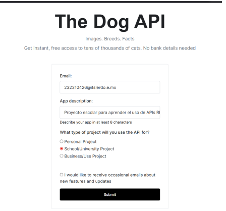
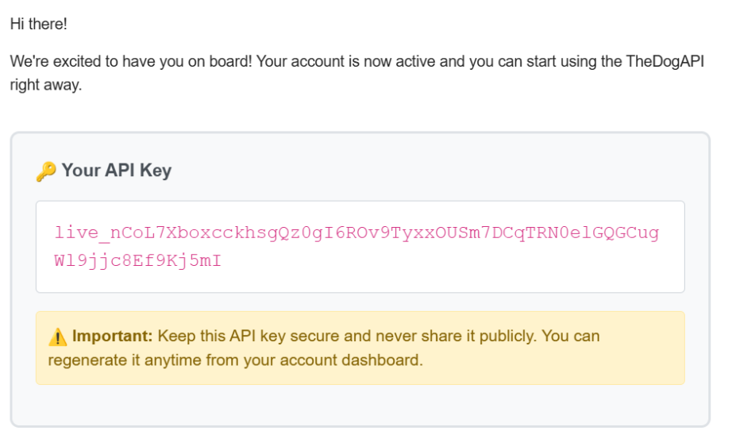
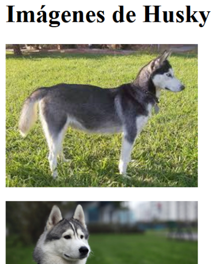

# Proyecto_03 - Rest API

## 1. Nombre del proyecto

Consumo de The Dog API utilizando PHP y cURL

## 2. Objetivo del proyecto

Aprender el funcionamiento de una API REST mediante el consumo de información desde The Dog API utilizando PHP y cURL para obtener datos en formato JSON y mostrar imágenes dinámicamente.

## 3. Problema que resuelve

Permite obtener información de una fuente externa mediante servicios web, demostrando cómo una aplicación puede comunicarse con APIs para recuperar y mostrar información en tiempo real.

## 4. Tecnologías utilizadas

* PHP
* cURL
* JSON
* HTML
* The Dog API
* XAMPP

## 5. Conceptos aplicados

* Consumo de APIs REST
* Solicitudes HTTP GET
* Uso de API Key
* Manejo de respuestas JSON
* Integración de servicios web externos
* Programación en PHP
* Uso de cURL
* Procesamiento de datos obtenidos desde una API

## 6. Capturas de pantalla

### Registro

### Verificacion de Registro

### Imagen Husky

## 7. Instrucciones de ejecución

1. Instalar XAMPP.
2. Verificar que Apache esté activo.
3. Habilitar la extensión cURL en php.ini.
4. Obtener una API Key en The Dog API.
5. Colocar la API Key en el código.
6. Ejecutar los archivos PHP desde localhost.
7. Visualizar la lista de razas y las imágenes obtenidas desde la API.

## 8. Reflexión personal

### ¿Qué aprendí?

Aprendí a consumir APIs REST utilizando PHP y cURL, a trabajar con respuestas JSON y a integrar información externa dentro de una aplicación web.

### ¿Qué fue difícil?

La parte más complicada fue integrar todas las funcionalidades en un único programa, ya que surgieron problemas al mostrar correctamente las imágenes recuperadas desde la API.

### ¿Qué mejoraría?

Me gustaría investigar más sobre el manejo de respuestas HTTP y la depuración de aplicaciones para solucionar problemas relacionados con la visualización de contenido obtenido desde APIs externas.

